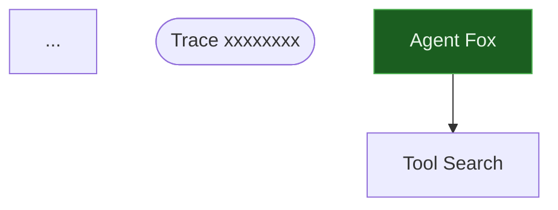

# Canvas 绘图 API 参考手册

## 1. 核心功能

Canvas 将 Debugger 的 trace 数据渲染为 Mermaid 流程图，支持：
- 撤销/重做操作
- 多图层管理
- 自定义样式

## 2. 快速开始

```python
from core.debugger import Debugger
from core.canvas import Canvas

debugger = Debugger(tracer=tracer)
debugger.attach()
# ... 运行任务 ...

canvas = Canvas(debugger)
mermaid_code = canvas.render()
canvas.save("docs/flow.md")
```

## 3. 撤销/重做

```python
# 撤销上一次操作
canvas.undo()

# 重做上一次撤销
canvas.redo()
```

## 4. 图层管理

```python
# 添加图层
canvas.add_layer("background")

# 删除图层
canvas.remove_layer("background")

# 合并图层
canvas.merge_layers("target_layer", "source_layer")
```

## 5. 渲染

```python
# 渲染指定 trace
mermaid = canvas.render(trace_id="trace-abc")

# 渲染所有 trace
mermaid = canvas.render()
```

## 6. 保存

```python
# 保存到文件
canvas.save("docs/flow.md")
# 自动包裹 ```mermaid 代码块
```

## 7. 样式

Canvas 使用森林风格的 Mermaid 主题色：

| 类型 | 颜色 |
|------|------|
| agent | 深绿 #1b5e20 |
| tool | 深蓝 #0d47a1 |
| model | 橙色 #e65100 |
| event | 紫色 #4a148c |
| error | 红色 #b71c1c |

## 8. 节点类型

- `agent`：Agent 节点
- `tool`：工具调用节点
- `model`：模型调用节点
- `event`：事件节点
- `error`：错误节点

## 9. 输出格式



## 10. 注意事项

- 需要 Debugger 已附加到 Tracer 并有 trace 数据
- 无 trace 数据时渲染占位节点
- 保存文件自动创建目录
